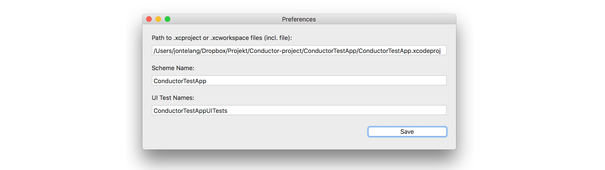

 

# In short
Conductor is a macOS application that lets you start your UI tests on any installed simulator on your device without having to fiddle with the Xcode UI.

# Demonstration
This is what a simple run of _Conductor_ can look like. Here I start the UI tests on two different simulators on two different iOS versions.

# How it works

The app will ask the system (actually instruments.app) for the installed simulators on the system and list them nicely for the user. When a user clicks on a simulator, it will start a new task (NSTask) with Xcodes command line tool "xcodebuild" with the users project as the arguments. At that point xcodebuild essentially takes over the actual running of each test and _Conductor_ will simply read the output and try to determine the status of the test.

# Screenshots

# Use cases compared to other solutions

Conductor was made to solve the problem of starting many UI tests without hassle (but not _too_ many) while also keeping the visual niceness of Xcodes UI testing tools.

Currently there are a few other solutions, all good in their own way, but neither worked exactly the way I wanted them too, so I started building _Conductor_. Here they are and the reasons they didn't work for me:

### Xcode 
Has a nice UI and really really great inspection tools for each test that fails, with screenshots, logs and all sorts of data around the tests. However, it fails when you want to test on many different iOS versions and simulators simultaneously as you have to kick them off manually through a dropdown menu. It creates a lot of friction.

### xcodebuild (DIY scripts)
Also pretty great (_Conductor_ uses it behind the scenes) as it allows a lot of flexibility. However since I wanted to have a bit more control over when I started each simulator, it made it more cumbersome to write increasingly large scripts. It also lacks the intuitive feel a GUI can give you. 

Another issue is that all test results are put into very large .plist files, making it tedious to get into the results without either using a third party inspector or manually go digging.

_Conductor_ actually started off as a pure results viewer, and eventually it will return into the app.

### Fastlane
Seemed to work, and it seemed to have the proper result viewer (or at least an HTML report generated) but since it is a CLI it is more useful for maybe continous integration type of settings. It wouldn't be easily possible to restart a specific simulator from it.

It also needs another tool (Fastlane) installed which you might not want.

### Others
I don't recall looking at other tools, but there might be some.

# TODO

- [ ] Results viewer

- [ ] Filter simulator list by e.g. iOS version or device type

- [ ] Allow for multi selection in list and starting multiple tests simultaneously

- [ ] Get a nicer icon

- [ ] See currently running test

# Contributing

Feel very free to send me ideas or PRs. I'll happily accept contributions.
